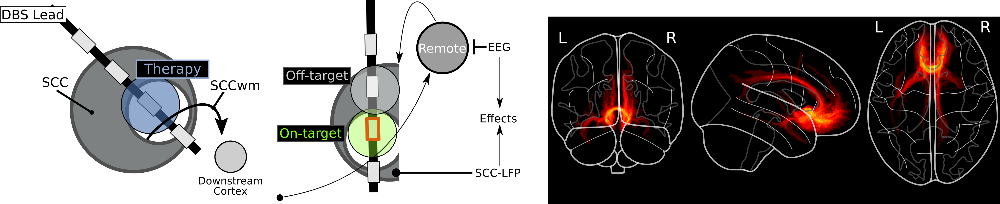
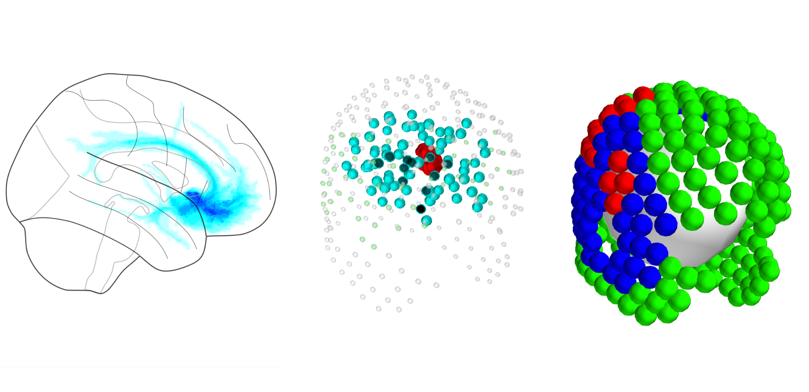
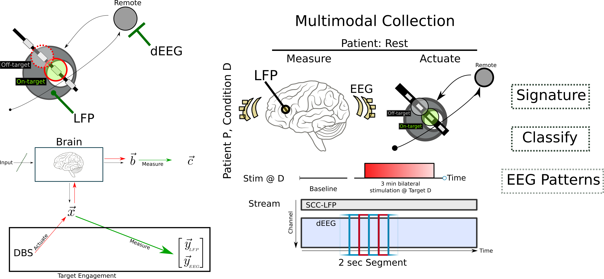

# Cortical Signatures of SCCwm-DBS

## Overview
In this repository I perform analysis of combined LFP and EEG recordings during SCCwm-DBS.
This repository uses the DBSpace library.

## Outline

This is the code related to the third aim of my thesis where I try to characterize the immediate whole-brain effects of SCCwm-DBS on oscillatory dynamics.
I then develop an EEG-based classifier that can confirm adequate *target engagement*.

Head on over to the notebook for a more complete [overview](Notebooks/CC_Overview.ipynb)

The overall goal here is to better understand how DBS in the SCC, specifically targeted at individualized SCCwm, changes the dynamics in the brain.
This change in dynamics is likely related to the long-term efficacy of treatment.

Using a combination of invasive and noninvasive neural recordings, I identified the specific oscillatory pattern evoked by SCCwm DBS on whole-brain network activity.
Focusing specifically on $\alpha$ oscillations, we see that SCCwm DBS evokes a specific response that is easily differentiated from identical stimulation at a nearby electrode.

I then used the per-patient tractography to dissect out the immediate and secondary effects of SCCwm DBS.

## Results Summary
First, I find that SCCwm-DBS evokes specific changes across both LFP and EEG.
Specifically, precise stimulation of SCCwm evokes changes only in *remote* measurements (EEG) and not in *local* measurements (LFP).

Second, I find that SCCwm-DBS evokes a conserved pattern across EEG recordings under SCCwm-DBS, characterizing this as the *network action* of SCCwm-DBS.

Third, I develop an EEG classifier capable of confirming SCCwm-DBS, with coefficients aligned with tractography engaged.

Fourth, I perform more detailed analysis of the dynamics evoked by SCCwm-DBS, finding a novel *dynamic oscillation* that is associated with the network being stimulated.

## Methods

